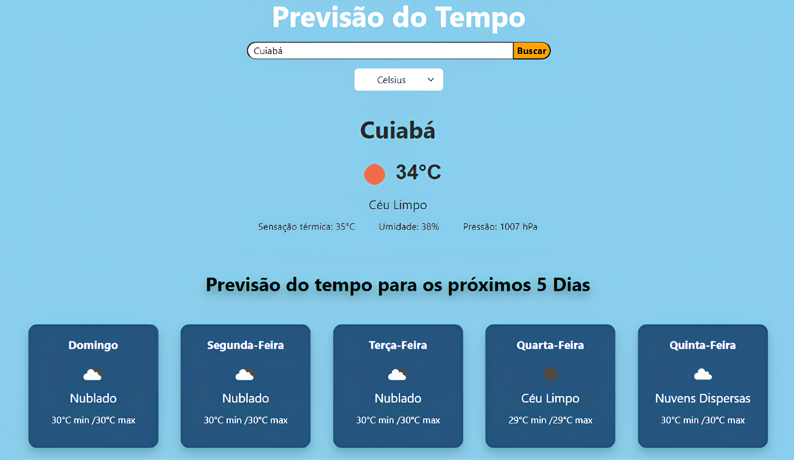

<h1 align="center">Previsão do Tempo</h1>

## Descrição

Este projeto é uma aplicação web de previsão do tempo que utiliza a API OpenWeather para fornecer informações meteorológicas detalhadas. A interface é simples e intuitiva, permitindo ao usuário buscar a previsão do tempo para diferentes localidades e alternar entre Celsius e Fahrenheit. Além disso, exibe a previsão do tempo para os próximos 5 dias com detalhes de temperatura mínima e máxima, condições climáticas e umidade.

 

## Características

- Busca de previsão do tempo em tempo real para qualquer localidade.
- Alternância entre as escalas de temperatura Celsius e Fahrenheit.
- Exibição das condições climáticas, como sensação térmica, umidade e pressão.
- Previsão para os próximos 5 dias com temperatura mínima, máxima e estado do tempo. (versão beta)
- Interface amigável e responsiva, com mudanças de cor baseadas nas condições climáticas.

## Licença

Licença MIT

Direitos autorais (c) 2024-* Adriel Almeida Pereira Leite

É concedida permissão, gratuita, a qualquer pessoa que obtenha uma cópia
deste software e arquivos de documentação associados (o "Software"), para lidar
no Software sem restrições, incluindo, sem limitação, os direitos
para usar, copiar, modificar, mesclar, publicar, distribuir, sublicenciar e/ou vender
cópias do Software e permitir que as pessoas a quem o Software é destinado
mobiliado para tal, sujeito às seguintes condições:

O aviso de direitos autorais acima e este aviso de permissão devem ser incluídos em todos
cópias ou partes substanciais do Software.

O SOFTWARE É FORNECIDO "NO ESTADO EM QUE SE ENCONTRA", SEM GARANTIA DE QUALQUER TIPO, EXPRESSA OU
IMPLÍCITA, INCLUINDO, MAS NÃO SE LIMITANDO ÀS GARANTIAS DE COMERCIALIZAÇÃO,
ADEQUAÇÃO A UM DETERMINADO FIM E NÃO VIOLAÇÃO. EM NENHUMA HIPÓTESE O
OS AUTORES OU TITULARES DOS DIREITOS AUTORAIS SERÃO RESPONSÁVEIS POR QUALQUER RECLAMAÇÃO, DANOS OU OUTROS
RESPONSABILIDADE, SEJA EM UMA AÇÃO CONTRATUAL, ATO ILÍCITO OU OUTRO, DECORRENTE DE,
FORA OU EM CONEXÃO COM O SOFTWARE OU O USO OU OUTRAS NEGOCIAÇÕES NO
PROGRAMAS.
